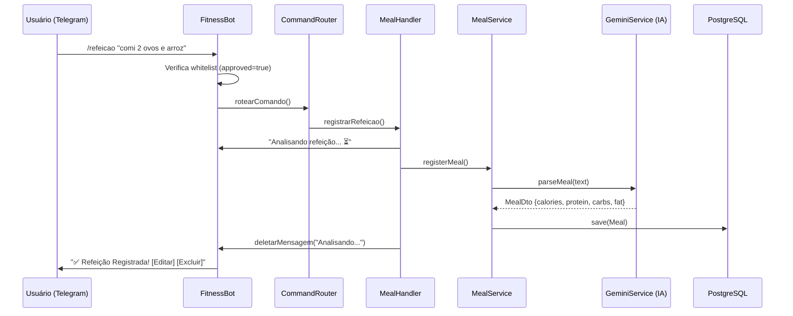

<div align="center">

# 🏋️‍♂️ ShapeLog.ai

**Assistente inteligente de nutrição e treinos via Telegram, alimentado por IA generativa.**

[](https://github.com/Savio-Marques/ShapeLog.ai/actions/workflows/deploy.yml)
[](https://openjdk.org/)
[](https://spring.io/projects/spring-boot)
[](https://www.docker.com/)
[](./src/test)
[](./LICENSE)

</div>

---

## 📌 Sobre o Projeto

O **ShapeLog.ai** é um bot para o Telegram que utiliza a IA generativa do **Google Gemini 2.5 Flash** (via Spring AI) para processar relatos de alimentação e treinos em **texto e áudio**, estruturando automaticamente macronutrientes, séries e cargas em um banco de dados PostgreSQL.

O projeto foi construído com foco em **qualidade de código**, **segurança** e **práticas de produção reais**: pipeline CI/CD automatizado, multi-ambiente com Spring Profiles, whitelist dinâmica de usuários e suíte completa de testes automatizados.

---

## ✨ Funcionalidades

| Funcionalidade | Descrição |
|---|---|
| 🎙️ **Entrada por Áudio** | Grave um áudio relatando sua refeição ou treino — a IA transcreve e estrutura os dados |
| 📝 **Entrada por Texto** | Descreva em linguagem natural o que comeu ou treinou |
| 🥗 **Registro de Refeições** | Extrai automaticamente calorias, proteínas, carboidratos e gorduras |
| 🏋️‍♂️ **Registro de Treinos** | Estrutura exercícios com nome, séries, repetições e cargas |
| 📊 **Relatório Diário** | Progresso completo do dia comparado às suas metas pessoais |
| 🎯 **Metas Personalizadas** | Defina suas metas de macros com `/meta` — salvas no banco em tempo real |
| ✏️ **Edição Inline** | Botões no próprio chat para editar ou excluir refeições e exercícios |
| 🔐 **Whitelist Dinâmica** | Admin aprova/revoga usuários via Telegram sem reiniciar nada |
| 🔔 **Notificação de Acesso** | Admin recebe alerta automático quando alguém tenta usar o bot sem permissão |

---

## 📱 Screenshots

| Registro de Refeição via Áudio | Registro de Treino | Relatório Diário |
| :---: | :---: | :---: |
|  |  |  |

---

## 🏗️ Arquitetura

```
com.bot.telegram/
├── bot/                  ← Entrypoint: FitnessBot (Telegram), CommandRouter
│   ├── handler/          ← Orquestração de fluxo (MealHandler, WorkoutHandler, ReportHandler)
│   └── keyboard/         ← Fábrica de botões inline (InlineKeyboardFactory)
├── formatter/            ← Camada de apresentação (MessageFormatter — MarkdownV2)
├── service/              ← Regras de negócio puras (MealService, WorkoutService, UserService, GeminiService, ReportService)
├── model/                ← Entidades JPA (UserTelegram, Meal, WorkoutSession)
├── dto/                  ← Objetos de transferência (MealDto, WorkoutDto, DailyReportDto)
├── repository/           ← Spring Data JPA Repositories
└── config/               ← Configurações Spring
```

### Fluxo de uma Mensagem



---

## 🛠️ Stack Tecnológica

| Camada | Tecnologia |
|---|---|
| **Linguagem** | Java 17 |
| **Framework** | Spring Boot 4.1 |
| **Inteligência Artificial** | Spring AI + Google Gemini 2.5 Flash (Vertex AI) |
| **Banco de Dados** | PostgreSQL 15 |
| **ORM** | Spring Data JPA / Hibernate |
| **Bot API** | TelegramBots 6.8 |
| **Conteinerização** | Docker + Docker Compose |
| **CI/CD** | GitHub Actions |
| **Nuvem** | Oracle Cloud Infrastructure (OCI) — ARM64 |
| **Testes** | JUnit 5 + Mockito + H2 (in-memory) |

---

## ⚙️ CI/CD Pipeline

A cada `git push` na branch `main`, o pipeline executa automaticamente:

```
git push main
      │
      ▼
┌─────────────────────────────┐
│  1. 🧪 Roda 39 Testes       │ ← Se falhar, deploy é cancelado
│  2. 🐳 Build Imagem ARM64   │
│  3. 📦 Push → Docker Hub    │
│  4. 🔑 SSH → VPS OCI        │
│  5. 🚀 docker compose up -d │
└─────────────────────────────┘
```

### 🎛️ Painel de Controle do Bot (GitHub Actions)

Na aba **Actions** do repositório, o workflow **"🤖 Bot Control"** permite gerenciar o bot em produção sem acessar a VPS:

- `start` — Liga o bot
- `stop` — Para o bot (banco continua rodando)
- `restart` — Reinicia o bot
- `status` — Exibe status dos containers e logs em tempo real

---

## 🚀 Como Rodar Localmente

### Pré-requisitos
- Java 17+
- Docker Desktop
- Conta no Google Cloud com Vertex AI habilitado
- Bot criado no Telegram via [@BotFather](https://t.me/BotFather)

### 1. Clone o repositório
```bash
git clone https://github.com/Savio-Marques/ShapeLog.ai.git
cd ShapeLog.ai
```

### 2. Configure as variáveis de ambiente

Crie um arquivo `.env` na raiz do projeto (nunca commite este arquivo):

```env
# Telegram
TELEGRAM_BOT_TOKEN=seu_token_aqui
TELEGRAM_BOT_USERNAME=seu_bot_username
TELEGRAM_BOT_ADMIN_ID=seu_id_telegram

# PostgreSQL
POSTGRES_DB=shapelog
POSTGRES_USER=shapelog_user
POSTGRES_PASSWORD=sua_senha_aqui
SPRING_DATASOURCE_URL=jdbc:postgresql://localhost:5432/shapelog

# Google Cloud
VERTEX_AI_PROJECT_ID=seu_project_id
VERTEX_AI_LOCATION=us-central1
```

### 3. Suba o banco de dados local
```bash
docker compose -f docker-compose.dev.yml up -d
```

### 4. Configure o perfil de dev no IntelliJ
Em **Run Configurations → Environment Variables**, adicione:
```
SPRING_PROFILES_ACTIVE=dev
```
E configure as mesmas variáveis do `.env` nas variáveis de ambiente do IntelliJ.

### 5. Inicie a aplicação
```bash
./mvnw spring-boot:run
```

---

## 🧪 Testes

```bash
./mvnw test
```

**39 testes automatizados** organizados por camada:

| Classe de Teste | Tipo | Qtd |
|---|---|---|
| `MessageFormatterTest` | Unitário (Mockito) | 9 |
| `CommandRouterTest` | Unitário (Mockito) | 10 |
| `StateManagerTest` | Unitário (Puro) | 4 |
| `UserServiceTest` | Unitário (Mockito) | 7 |
| `MealServiceTest` | Unitário (Mockito) | 5 |
| `ReportServiceTest` | Unitário (Mockito) | 3 |
| `TelegramApplicationTests` | Sanidade | 1 |

---

## 💬 Comandos do Bot

### Comandos Gerais

| Comando | Descrição |
|---|---|
| `/start` | Exibe o menu de boas-vindas com todos os comandos |
| `/refeicao <descrição>` | Registra uma refeição (ou só `/refeicao` para aguardar áudio/texto) |
| `/treino <título>` | Inicia um treino com o título informado |
| `/exercicio <descrição>` | Adiciona exercícios ao treino do dia |
| `/meta <kcal> <prot> <carbs> <gord>` | Atualiza suas metas diárias de macros |
| `/relatorio` | Gera o relatório do dia atual |
| `/relatorio ontem` | Gera o relatório do dia anterior |
| `/relatorio DD/MM/AAAA` | Gera o relatório de uma data específica |

### Comandos de Administrador

| Comando | Descrição |
|---|---|
| `/aprovar <ID>` | Aprova um usuário na whitelist e notifica ele |
| `/revogar <ID>` | Remove o acesso de um usuário |
| `/usuarios` | Lista todos os usuários aprovados |

---

## 🔐 Segurança

- **Whitelist dinâmica** no banco de dados — nenhum usuário não autorizado consegue usar o bot
- **Autorização de recursos** — cada usuário só pode editar/excluir seus próprios dados
- **Variáveis de ambiente** — nenhuma credencial hardcoded no código
- **Container não-root** — a aplicação Docker roda com usuário `spring` sem privilégios
- **Log de tentativas** — tentativas de acesso não autorizado são logadas com `WARN`
- **Chaves SSH e credenciais** ignoradas pelo `.gitignore`

---

## 📁 Estrutura do Deploy

```
/home/ubuntu/shapelog-bot/
├── docker-compose.yml        ← Orquestra o bot + banco
├── .env                      ← Variáveis de ambiente (não versionado)
└── gcp-credentials.json      ← Credenciais GCP (não versionado)
```

---

## 👤 Autor

**Sávio Marques**

[](https://linkedin.com/in/savio-marques)
[](https://github.com/Savio-Marques)
