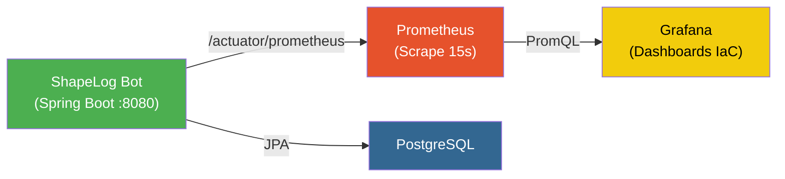
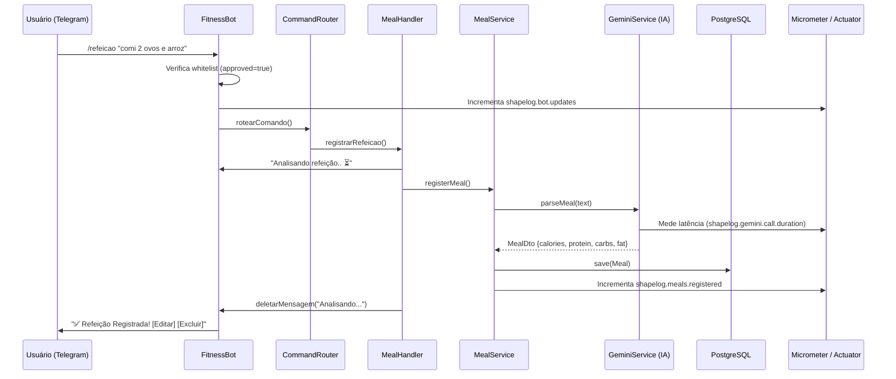

<div align="center">

# 🏋️‍♂️ ShapeLog.ai

**Assistente inteligente de nutrição e treinos via Telegram, alimentado por IA generativa e equipado com Observabilidade completa em tempo real.**

[](https://github.com/Savio-Marques/ShapeLog.ai/actions/workflows/deploy.yml)
[](https://openjdk.org/)
[](https://spring.io/projects/spring-boot)
[](https://prometheus.io/)
[](https://grafana.com/)
[](https://www.docker.com/)
[](./src/test)
[](./LICENSE)

</div>

---

## 📌 Sobre o Projeto

O **ShapeLog.ai** é um bot para o Telegram que utiliza a IA generativa do **Google Gemini 2.5 Flash** (via Spring AI) para processar relatos de alimentação e treinos em **texto e áudio**, estruturando automaticamente macronutrientes, séries e cargas em um banco de dados PostgreSQL.

O projeto foi construído com foco em **qualidade de código**, **segurança**, **observabilidade avançada** e **práticas de produção reais**:
- Pipeline CI/CD automatizado com GitHub Actions.
- Stack de **Observabilidade (Prometheus + Grafana)** com métricas customizadas de negócio e infraestrutura.
- Provisionamento automatizado de dashboards via **Infrastructure as Code (IaC)**.
- Arquitetura multi-ambiente (Dev & Prod) com Docker Compose e Spring Profiles.
- Whitelist dinâmica de usuários e suíte completa de testes automatizados com JUnit 5 e Mockito.

---

## ✨ Funcionalidades

| Funcionalidade | Descrição |
|---|---|
| 🎙️ **Entrada por Áudio** | Grave um áudio relatando sua refeição ou treino — a IA transcreve e estrutura os dados |
| 📝 **Entrada por Texto** | Descreva em linguagem natural o que comeu ou treinou |
| 🥗 **Registro de Refeições** | Extrai automaticamente calorias, proteínas, carboidratos e gorduras |
| 🏋️‍♂️ **Registro de Treinos** | Estrutura exercícios com nome, séries, repetições e cargas |
| 📊 **Relatório Diário** | Progresso completo do dia comparado às suas metas pessoais |
| 🎯 **Metas Personalizadas** | Defina suas metas de macros com `/meta` — salvas no banco em tempo real |
| ✏️ **Edição Inline** | Botões no próprio chat para editar ou excluir refeições e exercícios |
| 🔐 **Whitelist Dinâmica** | Admin aprova/revoga usuários via Telegram sem reiniciar nada |
| 📈 **Observabilidade & Métricas** | Monitoramento em tempo real com **Prometheus + Grafana** e métricas customizadas de negócio |
| 🔔 **Notificação de Acesso** | Admin recebe alerta automático quando alguém tenta usar o bot sem permissão |

---

## 📊 Observabilidade & Monitoramento (Prometheus + Grafana)

O **ShapeLog.ai** possui uma infraestrutura completa de observabilidade baseada no ecossistema Open Source **Micrometer + Prometheus + Grafana**.


```mermaid
graph LR
    A["ShapeLog Bot<br/>(Spring Boot :8080)"] -- "/actuator/prometheus" --> B["Prometheus<br/>(Scrape 15s)"]
    B -- "PromQL" --> C["Grafana<br/>(Dashboards IaC)"]
    A -- "JPA" --> D["PostgreSQL"]
    
    style A fill:#4CAF50,color:#fff
    style B fill:#E6522C,color:#fff
    style C fill:#F2CC0C,color:#000
    style D fill:#336791,color:#fff
```

### 🎯 Métricas Customizadas Instrumentadas (Micrometer)

Além das métricas padrões da JVM, CPU e HTTP, a aplicação exporta métricas de negócio do domínio:

| Métrica Prometheus | Tipo | Descrição / Rótulos |
|---|---|---|
| `shapelog_bot_updates_total` | Counter | Total de updates recebidos agrupados por tipo (`message`, `voice`, `callback`) |
| `shapelog_bot_errors_total` | Counter | Total de erros/exceções capturados no bot |
| `shapelog_bot_update_duration_seconds` | Timer | Tempo de latência de processamento dos updates do Telegram |
| `shapelog_gemini_calls_total` | Counter | Chamadas enviadas para a IA agrupadas por tipo (`meal`, `workout`) |
| `shapelog_gemini_call_duration_seconds` | Timer | Latência de resposta da IA Google Gemini |
| `shapelog_gemini_errors_total` | Counter | Falhas ou timeouts em chamadas à IA |
| `shapelog_meals_registered_total` | Counter | Refeições extraídas e salvas com sucesso no PostgreSQL |
| `shapelog_workouts_total` | Counter | Treinos criados com sucesso no PostgreSQL |
| `jvm_memory_used_bytes` | Gauge | Consumo de memória Heap/Non-Heap da JVM |
| `process_cpu_usage` | Gauge | Percentual de uso de CPU do container |

---

### 🎨 Dashboard Provisionado (Infrastructure as Code)

O Grafana é automaticamente provisionado através de arquivos de configuração em [`monitoring/grafana/`](file:///c:/Users/Sávio/Documents/projetos/telegram/monitoring/grafana/), sem necessidade de configuração manual na interface web:

- **Datasource Provisioning**: Conexão automática com o Prometheus (`http://prometheus:9090`).
- **Dashboard Provisioning**: Auto-load do dashboard [`ShapeLog Overview`](file:///c:/Users/Sávio/Documents/projetos/telegram/monitoring/grafana/dashboards/shapelog-overview.json) contendo 8 painéis interativos.

---

### 🔐 Acesso Seguro via Túnel SSH (Zero-Trust Production)

Em produção na VPS, a porta do Actuator (`8080`) e a porta do Prometheus (`9090`) são mantidas estritamente privadas na rede interna Docker (`shapelog-net`). O acesso ao Grafana é realizado com segurança máxima através de **Túnel SSH criptografado**:

```bash
# Túnel seguro conectando a porta 3000 local ao Grafana na VPS
ssh -i shapelog_ci -L 3000:localhost:3000 ubuntu@IP_DA_VPS
```

Com o túnel ativo, o painel fica acessível em `http://localhost:3000`.

---

## 📱 Screenshots

| Registro de Refeição via Áudio | Registro de Treino | Relatório Diário |
| :---: | :---: | :---: |
|  |  |  |

---

## 🏗️ Arquitetura do Projeto

```
com.bot.telegram/
├── bot/                  ← Entrypoint: FitnessBot (Telegram), CommandRouter
│   ├── handler/          ← Orquestração de fluxo (MealHandler, WorkoutHandler, ReportHandler)
│   └── keyboard/         ← Fábrica de botões inline (InlineKeyboardFactory)
├── config/               ← Configurações Spring (MetricsConfig, TelegramConfig)
├── formatter/            ← Camada de apresentação (MessageFormatter — MarkdownV2)
├── service/              ← Regras de negócio puras (MealService, WorkoutService, UserService, GeminiService, ReportService)
├── model/                ← Entidades JPA (UserTelegram, Meal, WorkoutSession)
├── dto/                  ← Objetos de transferência (MealDto, WorkoutDto, DailyReportDto)
└── repository/           ← Spring Data JPA Repositories
```

### Fluxo de uma Mensagem


```mermaid
sequenceDiagram
    participant U as Usuário (Telegram)
    participant F as FitnessBot
    participant R as CommandRouter
    participant H as MealHandler
    participant S as MealService
    participant AI as GeminiService (IA)
    participant DB as PostgreSQL
    participant M as Micrometer / Actuator

    U->>F: /refeicao "comi 2 ovos e arroz"
    F->>F: Verifica whitelist (approved=true)
    F->>M: Incrementa shapelog.bot.updates
    F->>R: rotearComando()
    R->>H: registrarRefeicao()
    H->>F: "Analisando refeição.. ⏳"
    H->>S: registerMeal()
    S->>AI: parseMeal(text)
    AI->>M: Mede latência (shapelog.gemini.call.duration)
    AI-->>S: MealDto {calories, protein, carbs, fat}
    S->>DB: save(Meal)
    S->>M: Incrementa shapelog.meals.registered
    H->>F: deletarMensagem("Analisando...")
    F->>U: "✅ Refeição Registrada! [Editar] [Excluir]"
```

---

## 🛠️ Stack Tecnológica

| Camada | Tecnologia |
|---|---|
| **Linguagem** | Java 17 |
| **Framework** | Spring Boot 4.1 |
| **Inteligência Artificial** | Spring AI + Google Gemini 2.5 Flash (Google AI Studio) |
| **Observabilidade** | Spring Boot Actuator + Micrometer + Prometheus + Grafana |
| **Banco de Dados** | PostgreSQL 15 |
| **ORM** | Spring Data JPA / Hibernate |
| **Bot API** | TelegramBots 6.8 |
| **Conteinerização** | Docker + Docker Compose |
| **CI/CD** | GitHub Actions |
| **Nuvem** | Oracle Cloud Infrastructure (OCI) — ARM64 |
| **Testes** | JUnit 5 + Mockito + H2 |

---

## ⚙️ CI/CD Pipeline

A cada `git push` na branch `main`, o pipeline executa automaticamente:

```
git push main
      │
      ▼
┌─────────────────────────────┐
│  1. 🧪 Roda 39 Testes       │ ← Se falhar, deploy é cancelado
│  2. 🐳 Build Imagem ARM64   │
│  3. 📦 Push → Docker Hub    │
│  4. 🔑 SSH → VPS OCI        │
│  5. 🚀 docker compose up -d │
└─────────────────────────────┘
```

---

## 🚀 Como Rodar Localmente

### Pré-requisitos
- Java 17+
- Docker Desktop
- API Key gratuita no Google AI Studio ([aistudio.google.com](https://aistudio.google.com/apikey))
- Bot criado no Telegram via [@BotFather](https://t.me/BotFather)

### 1. Clone o repositório
```bash
git clone https://github.com/Savio-Marques/ShapeLog.ai.git
cd ShapeLog.ai
```

### 2. Configure as variáveis de ambiente

Crie um arquivo `.env` na raiz do projeto (nunca commite este arquivo):

```env
# Telegram
TELEGRAM_BOT_TOKEN=seu_token_aqui
TELEGRAM_BOT_USERNAME=seu_bot_username
TELEGRAM_BOT_ADMIN_ID=seu_id_telegram

# PostgreSQL
POSTGRES_DB=shapelog
POSTGRES_USER=shapelog_user
POSTGRES_PASSWORD=sua_senha_aqui
SPRING_DATASOURCE_URL=jdbc:postgresql://localhost:5432/shapelog

# Google AI Studio
GEMINI_API_KEY=sua_api_key_aqui
```

### 3. Suba o ambiente Docker Dev (PostgreSQL, Prometheus e Grafana)
```bash
docker compose -f docker-compose.dev.yml up -d
```

### 4. Inicie a aplicação
```bash
./mvnw spring-boot:run -Dspring-boot.run.profiles=dev
```

### 5. Acessar o Monitoramento Local
- **Actuator Prometheus**: `http://localhost:8080/actuator/prometheus`
- **Prometheus Targets**: `http://localhost:9090/targets`
- **Grafana Dashboard**: `http://localhost:3000` (Login: `admin` / `admin`)

---

## 🧪 Testes

```bash
./mvnw test
```

**39 testes automatizados** organizados por camada:

| Classe de Teste | Tipo | Qtd |
|---|---|---|
| `MessageFormatterTest` | Unitário (Mockito) | 9 |
| `CommandRouterTest` | Unitário (Mockito) | 10 |
| `StateManagerTest` | Unitário (Puro) | 4 |
| `UserServiceTest` | Unitário (Mockito) | 7 |
| `MealServiceTest` | Unitário (Mockito) | 5 |
| `ReportServiceTest` | Unitário (Mockito) | 3 |
| `TelegramApplicationTests` | Sanidade | 1 |

---

## 💬 Comandos do Bot

### Comandos Gerais

| Comando | Descrição |
|---|---|
| `/start` | Exibe o menu de boas-vindas com todos os comandos |
| `/refeicao <descrição>` | Registra uma refeição (ou só `/refeicao` para aguardar áudio/texto) |
| `/treino <título>` | Inicia um treino com o título informado |
| `/exercicio <descrição>` | Adiciona exercícios ao treino do dia |
| `/meta <kcal> <prot> <carbs> <gord>` | Atualiza suas metas diárias de macros |
| `/relatorio` | Gera o relatório do dia atual |
| `/relatorio ontem` | Gera o relatório do dia anterior |
| `/relatorio DD/MM/AAAA` | Gera o relatório de uma data específica |

### Comandos de Administrador

| Comando | Descrição |
|---|---|
| `/aprovar <ID>` | Aprova um usuário na whitelist e notifica ele |
| `/revogar <ID>` | Remove o acesso de um usuário |
| `/usuarios` | Lista todos os usuários aprovados |

---

## 🔐 Segurança

- **Whitelist dinâmica** no banco de dados — nenhum usuário não autorizado consegue usar o bot
- **Autorização de recursos** — cada usuário só pode editar/excluir seus próprios dados
- **Zero-Trust Network** — portas de métricas e banco de dados fechadas para o tráfego externo da internet
- **Túnel SSH para Acesso Administrativo** — o Grafana é acessado com túnel SSH privado na VPS
- **Variáveis de ambiente** — nenhuma credencial hardcoded no código
- **Container não-root** — a aplicação Docker roda com usuário `spring` sem privilégios
- **Log de tentativas** — tentativas de acesso não autorizado são logadas com `WARN`

---

## 📁 Estrutura do Deploy na VPS

```
/home/ubuntu/shapelog-bot/
├── docker-compose.yml            ← Orquestra Bot, Postgres, Prometheus e Grafana
├── .env                          ← Variáveis de ambiente (não versionado)
└── monitoring/                   ← Configurações e Dashboards do Prometheus + Grafana (IaC)
    ├── prometheus.yml
    └── grafana/
        ├── provisioning/
        │   ├── datasources/prometheus.yml
        │   └── dashboards/dashboard.yml
        └── dashboards/shapelog-overview.json
```

---

## 👤 Autor

**Sávio Marques**

[](https://linkedin.com/in/savio-marques)
[](https://github.com/Savio-Marques)
